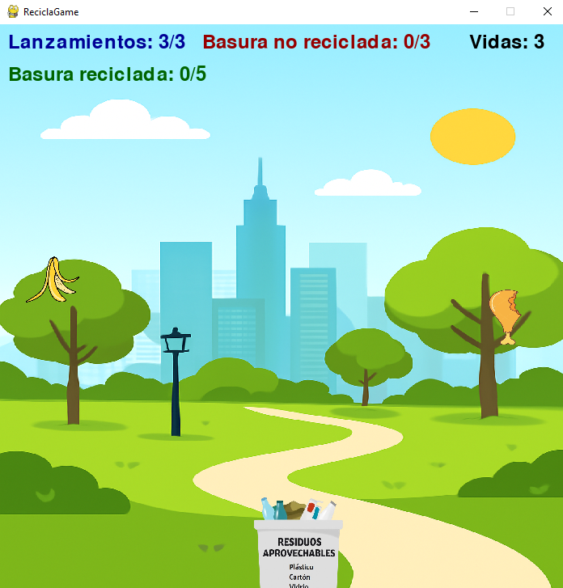

# Práctica 01: Fundamentos y Entorno de Desarrollo para Videojuegos
# ReciclaGame
ReciclaGame es un divertido juego educativo desarrollado en Pygame que busca concientizar sobre la importancia del reciclaje. El jugador controla un tacho de basura móvil en la parte inferior de la pantalla, y debe atrapar los desechos que caen del cielo.
## Asignatura:
Desarrollo de Software para Juegos

## Título de la Práctica:
Fundamentos y Entorno de Desarrollo para Videojuegos

## Integrantes:
- **Vega Figueroa, Angelo Jair**
- **Chura Puma, Mario Franco**
- **Quispe Quicaña, Victor Raul**
- **Solorzano Huamani, Vladimir Edson**

## Docente(s):
- **Dr.  Huanco Ramos, Fidel**

## Presentación del Juego:

